# Implemented Architecture Flow

This diagram shows the current repo implementation. It is source-record-first:
source records are truth, while raw refs, canonical objects, entity links,
retrieval units, vectors, audit records, and evidence packs are derived or
supporting surfaces.

It intentionally does not show planned production pieces such as Drive/Slack
message/live CRM connectors, OpenSearch, external object storage, a message
broker, Kubernetes, final PII/tokenization controls, or a separately deployed
re-identification service.

```mermaid
flowchart TD
  Human["Human operator"] --> Agent["Agent / CLI workflow"]
  Agent --> SearchTool["search_context(query)"]

  subgraph source_inputs["Implemented Source Inputs"]
    EmailFixtures["Local email fixtures"]
    GmailSinger["Gmail Singer output"]
    ContextSnapshot["Linear / Twenty / Slack identity snapshot fixture"]
    Webhooks["JSON webhook source-change events"]
    TextPdf["Text-layer PDFs"]
    OpenClawChat["OpenClaw chat messages"]
  end

  subgraph extract["Extract And Adapt"]
    EmailParser["Email parser"]
    GmailAdapter["Gmail/Singer adapter"]
    SnapshotAdapter["Context snapshot adapter"]
    WebhookBacklog["webhook_events backlog"]
    PdfAdapter["pypdf text-layer adapter"]
    OpenClawAdapter["OpenClaw chat adapter"]
    RawLanding["raw landing refs"]
    SourceRecordModel["SourceRecord envelope"]
    ConnectorState["Connector jobs and checkpoints"]
    Scheduler["scheduler-safe run-imports"]
  end

  subgraph store["State Store"]
    LoadLayer["storage package<br/>ORM models, config, raw store, health, backup"]
    DB["SQLAlchemy state<br/>PostgreSQL target / SQLite fallback"]
    SourceRecords["source_records<br/>stable ref, source identity, lifecycle, permissions, JSONB metadata"]
    RawStore["local raw store<br/>filesystem backend"]
    CanonicalObjects["canonical_objects<br/>Person, Organization, Message, Document, WorkItem, Relationship"]
    EntityLinks["entity_links<br/>confidence, evidence, reason, status"]
    RetrievalRecords["retrieval_records<br/>derived retrieval units"]
    WebhookEvents["webhook_events<br/>durable source-change backlog"]
    AuditStore["audit_events"]
  end

  subgraph transform["Transform"]
    SourceChanges["SourceChange applier"]
    RetrievalPrep["retrieval-unit preparation<br/>900 words / 100 overlap default"]
    ObjectClasses["objects package<br/>Person, Organization, Message, Document, WorkItem, Relationship"]
    CanonicalMap["canonical object mapping"]
    EmployeeLinks["deterministic employee links<br/>email and source user ids"]
  end

  subgraph retrieval["Retrieval"]
    Principal["PrincipalContext<br/>human, agent, roles"]
    PermissionFilter["permission and lifecycle prefilter"]
    UnitSearch["retrieval unit search<br/>joined to source_records"]
    VectorSearch["vector index surface<br/>derived from retrieval units"]
    EvidencePack["evidence pack"]
    Related["source-backed related objects<br/>entity links + same thread"]
    Candidates["unresolved candidates<br/>ambiguous visible person names"]
  end

  subgraph ops["Implemented Runtime Proofs"]
    Compose["Docker Compose<br/>app, PostgreSQL, observability"]
    OTel["OpenTelemetry smoke<br/>local LGTM backend"]
    Readiness["internal-prod-readiness"]
    Acceptance["acceptance-proof<br/>import/search/audit/OTel/backup wiring"]
    DependencyContracts["dependency-contracts"]
    Dashboard["operator dashboard"]
  end

  EmailFixtures --> EmailParser --> SourceRecordModel
  GmailSinger --> GmailAdapter --> SourceRecordModel
  ContextSnapshot --> SnapshotAdapter --> SourceRecordModel
  Webhooks --> WebhookBacklog --> SourceChanges
  WebhookBacklog --> WebhookEvents
  TextPdf --> PdfAdapter --> SourceRecordModel
  OpenClawChat --> OpenClawAdapter --> SourceRecordModel

  SourceRecordModel --> SourceChanges
  SourceChanges --> SourceRecords
  SourceRecordModel --> RawLanding --> RawStore
  Scheduler --> ConnectorState
  Scheduler --> SourceRecordModel
  SourceRecordModel --> ConnectorState
  SourceChanges --> ObjectClasses --> CanonicalMap
  SourceChanges --> RetrievalPrep

  CanonicalMap --> CanonicalObjects
  CanonicalMap --> EmployeeLinks --> EntityLinks
  RetrievalPrep --> RetrievalRecords

  LoadLayer --> DB
  LoadLayer --> RawStore
  SourceRecords --> DB
  ConnectorState --> DB
  CanonicalObjects --> DB
  EntityLinks --> DB
  RetrievalRecords --> DB
  WebhookEvents --> DB
  AuditStore --> DB

  SearchTool --> Principal
  Principal --> PermissionFilter
  DB --> PermissionFilter
  PermissionFilter --> UnitSearch
  PermissionFilter --> VectorSearch
  UnitSearch --> EvidencePack
  VectorSearch --> EvidencePack
  CanonicalObjects --> EvidencePack
  EntityLinks --> EvidencePack
  EvidencePack --> Related
  EvidencePack --> Candidates
  EvidencePack --> Agent

  SearchTool --> AuditStore
  PermissionFilter --> AuditStore

  Compose --> Readiness
  Compose --> Acceptance
  Compose --> OTel
  Dashboard --> DB
  DependencyContracts --> Readiness
  Acceptance --> DB
  Acceptance --> AuditStore
```

## Current Behavior

- `search_context(query)` does not require a purpose. It returns structured
  context for the agent, not a business decision.
- Retrieval applies permission and lifecycle filtering before building the
  evidence pack. Linked entities and related objects are also filtered to
  visible source-backed objects.
- Evidence packs include `evidence_items`, `primary_objects`, `related_objects`,
  `entities`, `unresolved_candidates`, `limitations`, and `audit_ref`.
- Each search records a `search` audit event; returned evidence refs also
  record a `source_access` audit event.
- Related objects currently come from deterministic entity links and same-thread
  records. Broader graph expansion is not implemented.
- Unresolved candidates currently cover deterministic ambiguous first-name
  matches across visible person objects. Broader entity resolution is not
  implemented.
- Active agent and CLI surfaces do not expose reveal. PII/tokenization and
  reveal code is deferred/experimental and not part of the current runtime path.
- Active agent and CLI surfaces also do not expose source opening or
  `source_metadata`; agents use the source refs and URLs included in evidence
  packs.
- Source-record imports prepare `retrieval_records` for all active source
  records. Keyword search and vector indexing read those units and join back to
  `source_records`; the legacy `email_chunks` table is not populated by the
  active source-change import path.
- Webhook events land in `webhook_events` before being processed through the
  same `SourceChange` applier as connector imports.
- Text-layer PDFs can be imported as `Document` source records through `pypdf`.
  OCR and layout extraction are not implemented.
- OpenClaw chat capture is implemented as a fourok-side adapter that turns chat
  messages into `Message` source records. It strips untrusted control metadata
  from retrieval text and preserves source provenance. The next product path is
  an OpenClaw plugin RAG hook that injects a short permission-aware source
  summary before prompt assembly; explicit search tools remain secondary.
- Scheduled imports are implemented through `run-imports`, connector job state,
  checkpoints, retry planning, and systemd/cron-oriented Compose commands.
- Dependency contract spikes are implemented as an executable registry via
  `uv run fourok dependency-contracts`.

## Runtime Shape

- Docker Compose can run PostgreSQL, local observability, and the
  Python app container.
- App images are tagged with the current commit hash through `FOUROK_IMAGE_TAG`.
- Active Compose services have restart policies, health checks, named
  persistent volumes, loopback-bound host ports, and no `.reference` runtime
  dependency.
- PostgreSQL is the target store and uses JSONB for source/canonical metadata
  and entity-link evidence on new schemas.
- SQLite remains a local fallback for fast tests and development.
- `uv run fourok internal-prod-readiness` checks the static Compose/runbook
  readiness claim.
- `acceptance-proof` checks config loading, health, import, webhook processing,
  retrieval, evidence-pack shape, audit, source lifecycle behavior,
  OpenTelemetry export, access boundary, and PostgreSQL backup/restore command
  wiring. Repeated runs should use a fresh/reset acceptance database because
  the proof intentionally exercises idempotency-sensitive records.
- `dashboard` exposes operator-visible counts, link coverage, import state,
  webhook backlog state, audit counts, and alert guidance.

## Still Experimental Or Out Of Scope

- Live Linear/Twenty/Slack message connectors are not part of this implemented
  flow; the current context-substrate import uses a fixture/snapshot shape.
- Gmail ingestion exists through Singer output and a pilot runner, but
  attachment-heavy samples and Workspace/group permission mapping still need
  validation.
- Heavy document extraction, image/OCR PDF extraction, and memory-substrate
  comparison artifacts remain experiments, not the primary architecture path.
- Raw storage is local filesystem only; production object storage, encryption,
  and deletion propagation still need design and implementation.
- PII masking/tokenization and privileged re-identification are not active in
  this temporary internal flow. The active agent-facing surface is retrieval
  only.
